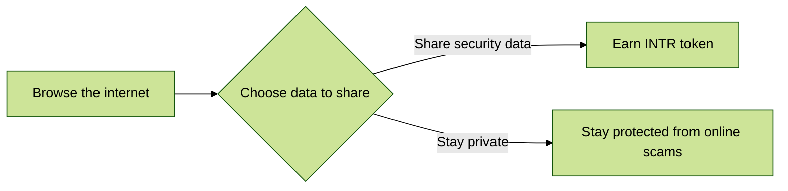

# About

Interlock is a data platform enabling intelligence and operational security, changing the cybersecurity paradigm with blockchain. Decentralized security, incentivized for everyone. 

[Want to try Interlock? Sign up for early access](https://www.interlock.network/)

Interlock is an ecosystem of Security and Analytics tools where people can be rewarded with 
crypto-currency tokens for contributing security and analytics data they control.

We are calling the space DeSec, the first of its kind decentralized security and intelligence. The first application in the ecosystem, as an example, is Airlock an anti-phishing and threat sharing platform that is a browser extension you can install and use; however, Airlock does not yet support blockchain and token earning, that is still a work-in-progress.

## Roadmap

## Tokenomics

[View Tokenomics](tokenomics.md)

**Want to join our team?**

[Check out what we're hiring for](https://interlock.breezy.hr/)

## Useful links
* [Join us on Discord](https://discord.gg/YuxsG8znG2)
* [Join our Telegram](https://t.me/interlockchat)
* [Follow us on Twitter](https://www.twitter.com/interlockweb3)
* [Join us on Reddit](https://www.reddit.com/r/interlocknetwork)
* [Airlock Security Platform](https://airlock.security)

## Support & Bug reports

We are usually available to chat at our [Discord](https://discord.gg/PbCYBbynqd) or [Telegram](https://t.me/+IxzitrEVH2A1ODYx), if you would like to ask
any questions or just talk to the developers about how great their day is today :) As for bug reports, please use
the [Issues tab](https://github.com/interlock-network/interlock-whitepaper/issues) and create a new issue, whether it's a typo in the white paper or you want something added/removed.

## The team
* [pspace](https://github.com/justerhan) - Project Owner & CTO
* [rickdeaconx](https://github.com/rickdeaconx) - Project Owner & CEO
* [galactic-beyond](https://github.com/galactic-beyond) - Project Owner & Principal Engineer
* andycheech - Chief of Marketing
* [mozberg](https://github.com/championshuttler) - Community Manager
* [JohnnyUtah](https://github.com/teachrdan) - Product Manager
* [jmercouris](https://github.com/jmercouris) - Sr. Engineer
* [memechoi](http://chasehoch.com/) - Creative & Design Lead
* [treevuhh](https://github.com/Treevuhh) - Executive Business Assistant
* [We're Hiring](https://interlock.breezy.hr/)

**Credits**

[Interlock](https://interlock-network.github.io/interlock-whitepaper/litepaper/litepaper/) is a decentralized, global team.
