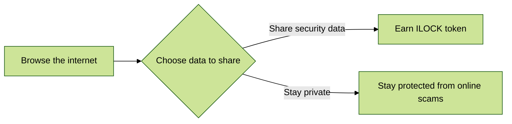

# What is Interlock?

Interlock protects DeFi while rewarding the people who make it safer.

Join the rebellion against cybercrime with ThreatSlayer. Our security browser extension gives instant protection from browser-based threats and rewards you for making the internet safer.
Start slaying cyber attacks now by downloading ThreatSlayer [HERE](https://chrome.google.com/webstore/detail/threatslayer/mgcmocglffknmbhhfjihifeldhghihpj)

[Join our discord](https://discord.gg/EP7Ukq6p) for the latest news.

You shouldn't have to worry about your tokens getting stolen or networks getting hacked. We are building out the world's first decentralized threat intelligence 
platform that strengthens the world’s ability to battle online threats. We’re creating an ecosystem of community-driven security products to protect DeFi, where 
people earn $ILOCK tokens for sharing anonymized data they control.

We are calling the space DeSec, the first of its kind decentralized security and intelligence. The first application in the ecosystem, as an example, is an anti-phishing and threat sharing platform that is a browser extension you can install and use; however, it does not yet support blockchain and token earning, that is still a work-in-progress.

## Sign up for Community Sale

Enter for a spot on the whitelist if you want to be notified when the community sale starts.
[Sign up for Community Sale](https://bit.ly/INTRwhitelist)

 ## Join the team

Interlock is not currently hiring. You can find future listings [here](https://interlock.breezy.hr/)

## Roadmap

## Tokenomics

[View token launch and supply](https://docs.interlock.network/token/supply.html)

## Useful links
* [Join us on Discord](https://discord.gg/YuxsG8znG2)
* [Join our Telegram](https://t.me/interlockchat)
* [Follow us on Twitter](https://www.twitter.com/interlockweb3)
* [Join us on Reddit](https://www.reddit.com/r/interlocknetwork)
* [Check out our FAQ](https://docs.interlock.network/faq.html#faq)

## Support & Bug reports

We are usually available to chat at our [Discord](https://discord.gg/PbCYBbynqd) or [Telegram](https://t.me/+IxzitrEVH2A1ODYx), if you would like to ask
any questions or just talk to the developers about how great their day is today :) As for bug reports, please use
the [Issues tab](https://github.com/interlock-network/interlock-docs/issues) and create a new issue, whether it's a typo in the white paper or you want something added/removed.

## The Team
* [rickdeaconx](https://github.com/rickdeaconx) - Project Owner & CEO
* [galactic-beyond](https://github.com/galactic-beyond) - Project Owner & Principal Engineer
* [andycheech](https://github.com/andycheech) - Chief of Marketing
* [JohnnyUtah](https://github.com/teachrdan) - Product Manager
* [jmercouris](https://github.com/jmercouris) - Sr. Engineer
* [blairmunroakusa](https://github.com/blairmunroakusa) - Software Engineer
* [memechoi](http://chasehoch.com/) - Creative & Design Lead
* [treevuhh](https://github.com/Treevuhh) - Chaos Operations Coordinator
* @Captain.Azero - Community Manager
* @ReuX - Community Manager

**Credits**

[Interlock](https://interlock.network) is a decentralized, global team.
