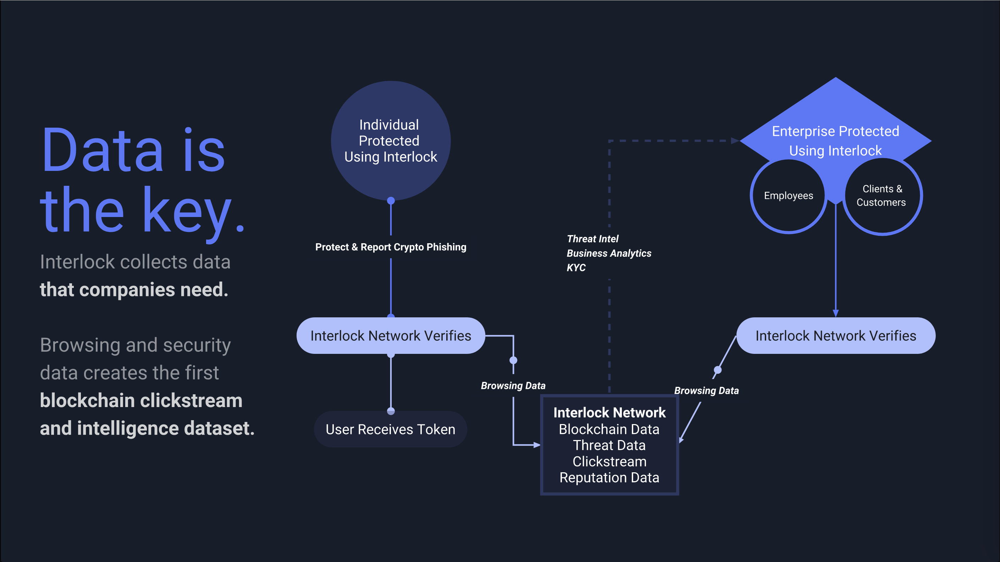

## Introduction: Trust, Security, and Privacy
Trust is the cornerstone of prosperity and innovation &mdash; it
facilitates interaction and exchange between people. Most waves of
progress arose from discovering social and technological means to *scale
up* trust. Everything from religion to education to banking to law to
trade-unions and so on, has helped scale mutual trust between people.
All of these mechanisms for promoting trust depend on centralized
institutions &mdash; instead of trusting every individual, people could
trust intermediaries like their bank or government. The explosive growth
of the internet has also caused people to, once again, outsource their
trust to central institutions. These institutions, however, exhibit many
of the same flaws as their predecessors &mdash; namely, they become
increasingly corrupt and increasingly exploitative, as their
revenue-growth inevitably declines. 

The Interlock Network leverages &mdash; among other things &mdash; the
latest Blockchain Technology to achieve decentralized and resilient
trust on the Web. While the early Web was the most democratic that the
Web has ever been, it was quite small. Growth exploded, however, when
Web2.0 came around, effectively democratizing and globalizing
*participation* on the Web. The darkside of Web2.0 is that it sustains
itself by data-mining and selling their users' personal information, in
addition to optimizing their feeds and search-results to keep users
engaged and clicking on advertisements. This state of affairs is a clear
*perversion* of the original vision, ideal, and promise of the Internet
and Web. The next evolution of the Web &mdash; the blockchain-powered
**web3** &mdash; can correct the course and re-democratize the web
without sacrificing its accessibility. 

In a sentence, the Interlock technology-stack moves security to the edge
of the network (i.e. the individual users) and collects anonymized data
from the edge to improve the threat-detection capabilities of different
parts of our stack. 

## Security
The mass onlining of people during the web2 era has created a
target-rich environment for cyber-criminals, scammers, and
high-tech-grifters. While people have to deal with online service
providers and social networks &mdash; that seek to exploit their
attention &mdash; they also have to deal with rapacious, anonymous
online criminals &mdash; that seek to exploit their bank-accounts and
credit-cards. A huge part of the problem is that the wealthiest
technology companies cannot justify the costs of securing their own
users, as securing them necessarily causes disruptions to their
advertising-revenue stream and disruptions to their
personal-data-marketplaces &mdash; which are often frequented by
criminals, and nation-state-actors. 

The insecurity of the internet-user &mdash; whether browsing from home,
from work, or on-the-go &mdash; has reached pandemic proportions. For
example, 75 percent of attacks are successful, and they have an an
average cost of around **4 million per attack**. These attackers **are
rapidly shifting their attention and resources to the *crypto currency
ecosystem***. 

## Improving Privacy and Security with Decentralization
There is an unintentional, but mutually-supporting, dynamic between the
corporate online platforms that violate our privacy and the criminal
online grifters that violate our security. Interlock believes that both
privacy and security can be improved by moving *trust* away from the
center of the network (i.e. Facebook, Google, etc) to the *edges* of the
network (i.e. directly into people's browsers and onto the blockchain). 

## Decentralizing Security with Ethereum, Solana, Interlock Extension
Security is a very difficult problem, and while much of the blame can be
directed at the incentives of large tech corporations, some of it can
also be directed at users feeling inconvenienced by security, for no
observable benefit. Just as (almost) nobody wants to brush their teeth
three times a day, nobody wants to jump through multiple security-hoops
and fight with their security tools to enjoy the internet. Good and
unintrusive security tools also face the *leaky-roof-problem* &mdash;
just as people usually do not notice the roof on their home until it
starts leaking, people do not notice security tools until they fail to
prevent a breach. 

Interlock takes a two-pronged approach to solving the problem &mdash; we
attack the problem in the browser and on the blockchain. 

We secure users' browsers from phishing-attacks, credential-theft,
impersonating-blockchain-sites, credit-card-phishing, credential-theft,
and scam-wallets with a &mdash; uBlock-based &mdash; browser extnesion
called Interlock. In addition to blocking ads, the extension uses an
advanced visual-indicator-of-threat to detect phishing pages and
scam-websites, and prevents users from entering any sensitive
information like passwords or usernames. We seek to motivate users to
install and use extension by linking it to a crypto-currency, called
INTER. Users earn INTER for installing the extension and browsing the
web with it. 

We use blockchain &mdash; a hybrid of Ethereum and Solana &mdash; to
allow users to interact and transact with each-other. No more walled
gardens. Users can create one or more INTER accounts and link them to
their various web2 accounts. Users can interact with each-other by
subscribing, denouncing, and sharing. The twist is that all of their
interactions are publicly visible and users can customize their feeds
and queries in ways that traditional platforms like twitter, tiktok, and
google could never allow without destroying their own profitability. We
essentially use blockchain to put the user back in control of their own
attention. 

While doing all of this, we collect all anonymized browsing data that
the user has chosen to share, and we use it to improve the data-sets
used for threat-detection, threat-intelligence, business-analytics, and
KYC. This data is then used by us and our partners (i.e. crypto-currency
exchanges and other commercial entities) to improve their products and
protect their customers. 

Please see the FAQ and technical whitepaper for more details and
information. 

## User Incentive Structure
The Interlock Network has structured the user-incentives to encourage
*thoughtful* interactions. To this end &mdash; and unlike every other
social network &mdash; most interactions have a *gas fee*. Users can
subscribe to (or denounce) accounts by spending special
*subscriber-tokens* &mdash; they can specify the amount and frequency of
the subscription. Upon doing so, the target account gets a significant
portion of those subscriber-tokens deposited into their account, and the
follower gets a *subscriber-receipt-token*. Subscriber-Receipt-Tokens
can be exchanged for INTER tokens at various times and at various
exchange rates. In other words, users stand to make money &mdash;
potentially &mdash; by *actively* subscribing &mdash; hoarding
subscriber-tokens will yield no rewards. Users can get subscriber-tokens
by either being popular/trustworthy (and therefor getting subscribers)
or by waiting for the vote-tokens to get airdropped into their account. 

## Emission Schedule
In short, we plan to emit **1 billion** tokens, in **5 phases**, each
subsequent phase doubling the total supply of tokens. Dates and times
for the phases are chosen at the discretion of the Interlock Team based
on strategic and economic circumstances &mdash; we are not committing to
any fixed emission schedule. This means that the token is short-term
inflationary but long-term deflationary. 

