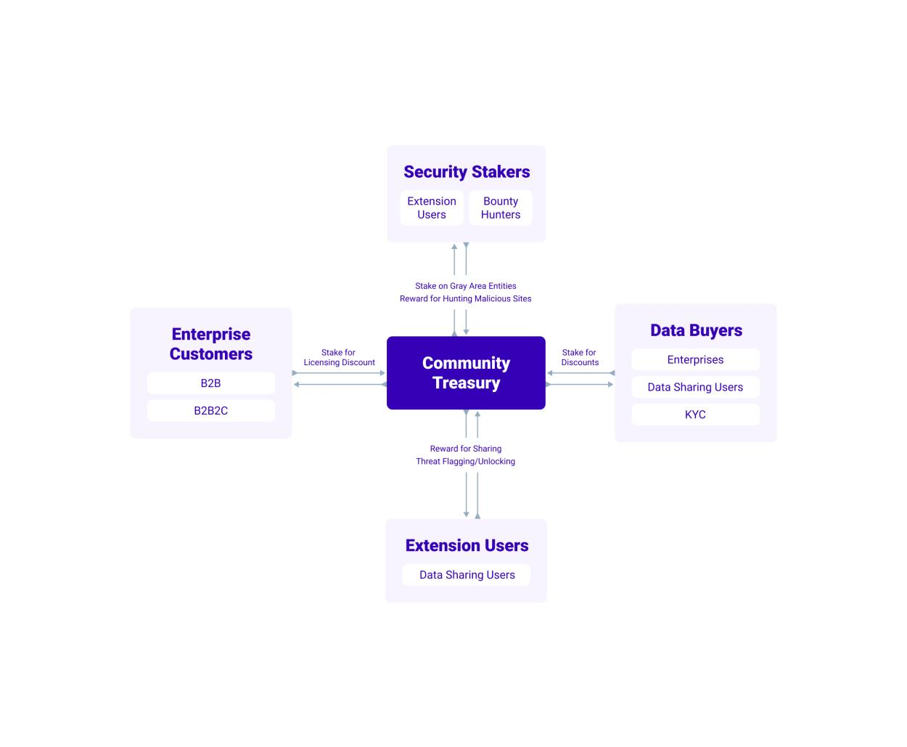

## Abstract
The web requires *trust* between many participants to reach its fullest
potential. However, we (as in humanity) have centralized the
trust-rating function to a handful of gatekeepers, who themselves have
questionable credibility and competence. We propose a solution that uses
blockchain and other technologies to increase security, privacy, and
trust and bypasses those gatekeepers.

## Introduction
The thing about these kinds of papers &mdash; whitepapers &mdash; is
that they are supposed to be confident, authoritative, and seductive.
Why, we hear you ask? Because stringing together words that create an
impression of authoritative and seductive confidence is what often
convinces people to buy whatever it is you are selling. Everybody wants
to invest in the impossible-to-miss certain-to-win solution to some
problem that the market has. We have gone through a lot of whitepapers
written with the confidence and certainty of a devout missionary seeking
converts and, of course, donors. We are not going to do that to you.

Make no mistake, we *are* trying to *convince* you of the merits of our
vision and idea &mdash; we just have no interest in *hypnotizing* you
into agreeing with us. If you believe that the Web is not living up to
its founding promises &mdash; and you want to change this &mdash; then
please read on.

## The Problem
### History
The writers of this paper, fellow traveler, are old enough to remember
the following: napster, gnutella, bit-torrent, Usenet, slashdot, RSS
Feeds, Tor, Google before it became evil, and Open Source before it
became cool. We remember an internet where nobody knew that you were a
dog &mdash; and, more importantly, nobody cared. We remember when being
social on the internet meant that you had a blog, read (and shared files
on) USENET, and participated in Slashdot discussions and flame-wars as
an 'Anonymous Coward'. We remeber that being informed meant that you
used Google Reader (RIP) to read RSS feeds which were absolutely
everywhere. And if you *really* wanted to stick it to The Man, you
installed Linux on your second-hand beige-box and Firefox on your folks'
Windows computer &mdash; we still have vivid memories and strong
feelings about MSFT, and quite a bit of residual PTSD and mental
scar-tissue. But, somewhere along the way, the internet took a turn. Now
people use Facebook instead of USENET, Twitter instead of RSS, and
Netflix, YouTube, and Spotify instead of BitTorrent. Also USENET,
Slashdot, and friends are all ghost-towns &mdash; while their nearest
equivalents have been overrun by trolls, cat-pictures, memes,
advertisers, and cybercriminals. Oh, and Microsoft is an increasingly
popular and increasingly open-source company &mdash; which is as
inconceivable as Ghengis Khan becoming an exemplary Red Cross volunteer.

Clearly, there has been a pendulum swing from a decentralized and
democratic internet to one that is significantly more centralized and
autocratic. A significant driver of this centralization has been the
insight that the majority of people are busy enough that they will give
up control for convenience &mdash; especially if that convenience has a
price-tag approaching *zero*. With the increase in convenience, things
like web-pages and blogs could be created by people who did not know how
to program or administer computers. Even if you did have this skill-set,
chances are you would apply it to a *virtual* computer in the *cloud*
rather than a physical one in your closet. This centralization of
computing was not sinister or evil &mdash; far from it &mdash; but it
was, rather paradoxically, a leap towards making the web accessible and
useful to more people than ever before. In other words, centralization
*did* democratize *participation* in the web, but it came at the expense
of freedom, control, and privacy. The web that you see today, is the web
that Google wants you to see when you use their search, that Facebook,
Twitter, and Instagram want you to see when you scroll through
"your" feed. And what they want you to see, is whatever will make you
re-share the content or click on an advertisement. You are, in effect,
plugged into The Matrix &mdash; the entire cyberpunk oeuvre is not
merely dystopic fiction, it is part prophesy and part warning.

Maybe you are thinking, that does not sound so bad &mdash; maybe we
*have* to sacrifice freedom, control, and privacy to democratize
participation in the web. Maybe. Maybe not. Maybe that is *exactly* what
the feudal Serfs were thinking while they were working the fields of
their lords &mdash; maybe we have to sacrifice control over our bodies,
our labor, and the (literal) fruits of that labor to democratize
participation in agriculture. After all, what is the alternative?
Starvation?

We sympathize, fellow traveler. We sympathize with you, because it is a
perfectly reasonable question to ask. Yes, being excluded and isolated
from the means of production of our era, is infinitely worse than having
our every action tracked, classified, and monetized. But unlike the
quarries, mines, farms, plantations, factories, and refineries of
previous eras &mdash; which all required capital to establish and
maintain and upgrade &mdash; the means of production of *our* era is,
well, **us**.

Do you post on reddit? *You* are creating the value, *they* are
capturing it. Do you make videos for YouTube? *You* are creating the
value, *they* are capturing it. Do you create content for OnlyFans?
*You* are creating the value, *they* are capturing it.

*They* conceive of a world where they data-mine &mdash; yes, the
exploitative nature of their business models is even reflected in their
*jargon* &mdash; everything we do, turn that data into money, and *we*
get (basically imaginary) shares, retweets, mentions, likes,
so-called-friends, and so-called-followers. They have even removed
negative actions such as dislikes for fear that it will drive users
&mdash; another revealing bit of jargon &mdash; away. Their mission is
to keep us happy and cheerful while we (happily and cheerfully) make
them money. You know who also does this? Farmers. What does that make
*us*? Livestock. Are you tired of being milked yet?

### It Gets Worse
The previous section was a little bleak &mdash; we will give you that.
But &mdash; as you can probably surmise from this section's title
&mdash; this paper is going to get bleaker before it gets brighter.

If the end of the previous section has you feeling like you have been
conned, like you are &mdash; sooner or later &mdash; going to be the
eventual victim of an unsustainable and tenuous pyramid scheme, well,
that was our intent. To be clear, we are not trying to scare you with
ghost stories. We *wish* these were just ghost stories &mdash; the
exaggerations of a handful of nerds, hackers, and cypherpunks trying to
shock you into listening. But the pyramid is built on a shaky foundation
and the dangers are real.

How could it get worse? Well, in addition to being exploited, and
metaphorically robbed, by the feudal lords of the internet, you are also
being exploited, and *literally* robbed, by the scammers and criminals
that have a growing presence on the internet. We have a multitude of
delightful statistics that back up this claim. The areas of cybercrime,
fraud, and identity-theft are so ripe and pregnant with opportunities
that even nation-states are eager to get in on it &mdash; and they are
not even trying to conceal their involvment. Yes, they give *zero*
fucks, because they are confident that the majority of the populace is
too distracted and too impoverished to actually &mdash; in the words of
Morpheus &mdash; *wake up*.

The obvious question is, why are there so many scammers and
cybercriminals. What is there to steal? Is it worth the risk? What are
the risks? Well, the modern cybercriminal is not like a bank-robber or
hostage-taker. The bank-robber or hostage-taker uses coercion and
intimidation to steal money. The modern cybercriminal is more like the
mythical japanese creature *noppera-bo*. This creature is a faceless
ghost that steals the faces of humans. Cybercrime is about stealing
people's faces and using them as masks &mdash; it is about *deception*
more than it is about coercion or violence. The faces in this metaphor
are usually authentication-credentials that may lead the criminal to
their ultimate goal, currency, crypto or otherwise.

And that is just the most obvious form of theft; material theft. Once
business, politics, and religion enter the equation, lines and
categories start to get blurry very fast. For example, can *truth* be
stolen? If so, does that make a flat-earther a criminal? What about the
corporate marketing department that uses flawed benchmarking
methodologies to convince you that their product is superior to the
competition? What about alternative or traditional medicine books? What
about the *hundreds* of pseudo-historical, pseudo-scientific, and
pseudo-sociological narratives that are weaved every election cycle to
convince people that their neighbors and fellow citizens are the cause
of their anguish &mdash; rather than the massive institutions,
corporations, and beaurocracies that have every incentive to profit from
and perpetrate anguish and tragedy across continents and across
generations (you do not have to look further than McDonalds and
Phillip-Morris)?

The point is, the truth is very important, but it can be hard to pin
down. Very few things can be considered absolute truths. The web &mdash;
under its current commercialized and oligarchic stewardship &mdash;
perpetuates, exacerbates, and profits from, vanity, greed, delusion,
ignorance, envy, hatred, and outrage. Instead, it should give users the
tools to better understand themselves, human nature, and our
connectedness to all things &mdash; an ancient idea that is in fact more
relevant to the modern world than it ever was to the ancient world.

Criminals and tech corporations both see the internet-user as something
to be exploited. The former seeks to attack and corrupt the state of
your bank account, while the latter seeks to attack and corrupt your
state of mind. You will find it easy, even effortless, to be angry with
the former, but you may find it difficult to be angry with the latter.
You cannot be angry with the tobacco company for selling you exactly
what you asked for.

### Identity, Trust, Belief
Before 1971, if you held a dollar in your hand and examined what was
written on it, you would see 'Exchangeable for Gold'. After 1971, it
would only say 'In God We Trust'. We believed in the dollar because we
believed in gold &mdash; now we believe in the dollar because we believe
in the dollar. This is what some historians would call a revolution,
others would call it a *paradigm shift*. Paradigm shifts, and for that
matter paradigms themselves, are &mdash; and please do not mistake this
for belittlement, quite the opposite in fact &mdash; entirely
*imaginary*. You cannot measure or touch a paradigm. A paradigm does not
emit heat or have mass. Yet paradigms have been the organizing principle
of society since humanity learned how to speak and write things down. A
paradigm is a shared hallucination.

Every paradigm contains the seeds of its own destruction. The bible was
the first book that was mass-printed &mdash; shortly after that the
catholic church lost half of its believers to the various protestant
denominations. The feudal and heriditary paradigms of Europe were eroded
and overthrown by the steady growth of capitalism. The industrial
capitalist paradigm had (after the Great Depression) given birth to both
fascism and communism. And the surviving contenders of the
Second World War, created the Cold War (i.e. bipolar) paradigm. This
paradigm collapsed into one of globalisation and informationalism.
Trading new gods for old.

Trust, just like a paradigm, is powered by *belief*. You cross the
street with minimal anxiety because you trust the drivers to be sober
enough to obey the traffic laws (also a good example of a paradigm). You
use the same two passwords on every site because you trust that the
programmers that made the site have a minimal level of technical
competence and a minimal regard for your security and privacy. Some
Runescape-playing twelve-year-old kid drops all their hard-earned loot
in front of another player and presses `Alt-F4` because the other
player told them it was a glitch that would duplicate all of the items
in their inventory &mdash; that kid *trusted* someone who was
*untrustworthy*, and learned a *painful* but *important* lesson about
*trust*. The internet is basically like that Runescape example. The
entire system depends on trust to get anything done, but there are too
many people and you cannot trust them blindly. What to do? Well, we did
what we have always done, we created institutions (i.e. social networks
and banks) and placed our *trust* and our *faith* in *them*. It sounds
perfectly reasonable, doesn't it? Sure. But such institutions are
powered by people, and the people &mdash; just like criminals and liars
&mdash; have to respond to market-pressures. We used to *trust* our
credit-rating-agencies to tell us which financial entities were
*creditworthy* &mdash; and then we had an economic *meltdown* in 2008
that destroyed the *trustworthiness* of those institutions themselves.
Centralizing trust in a handful of institutions will work in a pinch but
it could eventually, and without warning, fail &mdash; every paradigm
contains the seeds of its own destruction.

## The Internet's Paradigm
### Status Quo
The internet, and especially the Web, are either the result or cause
&mdash; hard to tell really &mdash; of a paradigm shift. The mass
on-lining of humanity has shifted the power (i.e. the value or economic
surplus) from the previous power-holders (i.e. the mass media, the
industry, the publishers, etc). Think about it, more people watched the
Fortnite tournament than actual sporting events. In fact, viewership of
the *Olympics* has started declining towards the end of the last decade
&mdash; after a half century of *growing* viewership. Book stores are no
longer mainstream, and the internet's pre-eminent book store has evolved
into a titanic giant that sells *everything* and delivers it to your
residence within 2 days &mdash; and they also collect rent for roughly
*one third* of all computation and storage that is provisioned on a
Cloud. A ride-sharing company has displaced local taxi-cab companies *in
the entire world* &mdash; not merely in a city or a state or a nation.
Video rental stores are few and far between, but the internet's
pre-eminent video rental store, Netflix, has emerged as a formidable
cultural force spending tens of billions of dollars per year producing
original and highly regarded, or at least highly viewed, films and
television series.

This is how paradigm shifts work. Companies try to build modest
businesses in the not-too-contested corner of the marketplace. The
paradigm starts shifting in their favor and they find themselves
capturing more surplus than they know what to do with. They slowly wake
up to the realization that they are at the top of the pyramid &mdash;
not by any strategic brilliance of their own, but rather, because the
pyramid shifted and contorted itself and they happened to be at the
right coordinates at the right time. Western Europe provides an
interesting case study &mdash; the place was a backwater far away from
any action until some adventerous sailors and navigators found sea
routes to Asia (that let them by-pass the Eastern Mediteranean
middle-men) and to the Americas (which would eventually house the worlds
most successful and likely last ever hegemon &mdash; as always, every
paradigm contains the seeds of its own destruction).

### New Paradigm
Different people have different ideas about what the next paradigm of
the web is. Web2.0 got us half-way to where we want to be. Its pioneers,
however, could not resist the incentives to maximize the proportion of
the economic surplus that they capture &mdash; even though these Web2.0
business are essentially *built by the users*. And what about Web3.0?
Depends on who you ask. Right now the mainstream thinks that Web3.0 is
the *semantic web* &mdash; a decades-old idea that has always struggled
to gain traction. Meanwhile, an increasing number of people believe that
Web3.0 will center around *blockchain technologies* &mdash; but they
call it **web3** (we will call it Web3.0 from now on in this paper).

We believe that the new paradigm for the internet/web is
hyper-decentralization. The web is decentralizing the media and the news
and the publishing industry. The web is decentralizing geography &mdash;
two people a million miles away can interact with each other over
video-chat or VR. The web is decentralizing finance &mdash; even stuffy
old banks want to get in on the DeFi bandwagon. The web is
decentralizing the nation-state &mdash; people often times have more in
common with globally dispersed like-minded individuals than their fellow
neighbors and citizens. The web is decentralizing employment &mdash; the
number of people working in the gig-economy and the creator-economy is
increasing (unfortunately this is another example of users creating a
surplus that is captured by online equivalent of a few feudal lords).

We believe that this accelerating trend of hyper-decentralization will
also decentralize the parts of the web that have to do with *trust*.
Right now, the intermediary institutions (i.e. Facebook, Twitter,
Reddit, HN, and so on) that ascribe credibility and trustworthiness do
so in ways that are *opaque*. We do not know *why* certain tweets appear
in our feeds and others do not &mdash; and even if we did, there is
nothing we can do to *customize* our feed (aside from
following/unfollowing various accounts). We can see a Reddit user's
karma-score as well as the score of their individual posts &mdash; which
is slightly less opaque than Hacker News's ranking system &mdash; but we
cannot see *who* up-voted or down-voted that user's posts. In fact, we
have no way of knowing if that karma score has not been accidentally
inflated by a random bit-flip on Reddit's servers &mdash; let alone if
it has been manipulated by an insider or inflated by a voting ring.
Similar logic applies to Twitter and Hacker News. Hacker News has
surprisingly insightful discussions, in spite of its concealment of
vote-metadata for posts, but it is still suseptible to insider
manipulation and voting rings. In short, almost everything you see in
the walled-gardens of the web &mdash; and almost every decision you make
&mdash; is determined &mdash; or at least strongly influenced by &mdash;
distant, nameless, and faceless product-managers and growth-hackers.

These institutions will tend towards fragmentation and decentralization
because, as it stands, they have too much influence over too many
people. If they translate their influence into power (i.e. translating
technical and economic means into political ends), they make other, more
traditional (and better armed), power-holders angry. If they sit idly
and collect profits without intervening in the affairs of their users
(i.e. translating technical means into economic ends), they make those
same power-holders just as angry for not doing enough. All major tech
giants, including amazon, apple, facebook, twitter, and google, are
being taken to court in nearly every major global jurisdiction &mdash;
and this is just the beginning, we can expect cases like these to extend
and multiply over the next decade, creating what is effectively a
power-vacuum that will be filled by smaller, less distracted players.

## Economics
### Intro: Three Strains of Economic Thought
Before we continue with our proposed solution, we should probably take a
brief detour into economics-land and express how our proposal fits into
the main frameworks of economics. From the late 1700s up to the
present-day three economic schools of thought have shaped societies
around the world &mdash; namely, the Neoclassical, the Keynesian, and
the Marxian. The Neoclassical school focused on individual freedom and
individual incentives, and rejected any form of state-intervention in
the economy &mdash; in other words they assumed that Utopia was
achievable without Leviathan. After the Great Depression set the
Neoclassical Utopia aflame, the Keynesian school arose and argued that a
Utopia could not be maintained without a Leviathan &mdash; they argued
that the individual was certainly important, but not nearly as important
as the *structure* of the economy. These two views correspond to
microeconomics (i.e. reasoning that individuals ruthlessly purseuing
their own self-interest will create the most desirable outcomes for all
of humanity) and macroeconomics (i.e. reasoning that *tracking*
macroeconomic indicators like GDP, unemployment, inflation, and
interest-rates and *tuning* those macroeconomic variables will create
the most desirable outcomes for all of humanity). Put differently, one
school thinks that individual behavior and actions *cause* the economy,
while the other school thinks that the economy *causes* individual
actions and behavior. To be clear, we are not taking sides, both points
of view are correct they just disagree about the *relative* value of one
component in relation to the others. And now onto the Marxian school
which requires its own paragraph.

The Marxians are primarily concerned with *the means of production*
&mdash; specifically, what they are, who is the class that owns them,
who is the class that operates them, what are their outputs, what is
their economic surplus, and who captures what proportion of that
surplus. They marvel at the economic efficiency and dynamism unlocked by
the transition from feudalism to capitalism, but they believe that any
arrangement in which the class that operates the means of production but
does not own or control those means is fundementally unjust, and does
not fulfil the (false) promises of Humanism (the philosophy undergirding
both Neoclassical and Keynesian social orders). They also believe that
individuals and economic-structures are always shaping each-other via
never-ending *dialectics* &mdash; in effect, they are *simultaneously*
cause *and* effect. And that is pretty much all of the Marxian school
*that is relevant to this paper* &mdash; there is a lot of other stuff
(i.e. central planning as a suitable alternative to the market) that is
simply not compatible with a globalized marketplace, nor is it
compatible with a trend towards hyper-decentralization.

We basically agree with all of these theories, and want to use the three
perspectives to construct a globally decentralized network that will
give users freedom, control, privacy, and security.

### Reputation and Trust
Trying to eliminate the intermediary institutions that ascribe trust is
a little bit like trying to eliminate the police or trying to eliminate
schools. Obviously policing and schooling are very important and nobody
would ever consider decentralizing them, let alone eliminating them. So
we should ask ourselves, what kind of a people have no need for the
police? What kind of people have no need for schools? The answer, fellow
traveler, is people that are *self-policing* and *self-schooling*.
Obviously, such people are very rare, otherwise we would not need
schools and police departments. However, a computer that is not under
the control of any single individual can in fact be used to implement
this kind of flawless self-regulation. If we go back to that earlier
Runescape example from Section 4, the game could have been programmed to
disallow such acts of deception &mdash; whether this makes the game
better is another matter entirely.

What we wish to do is to use the decentralized, history preserving, and
transactional nature of the blockchain to implement an anonymous
trust-network.

Our network associates users with accounts on the blockchain, similar to
how a licence plate is associated with a vehicle &mdash; though *unlike*
a license plate we do not associate the *identity* of the user with the
account.

If Web2.0 was about *websites* and *services*, we believe that Web3.0 is
about *people* and *content* and their *trustworthiness*.

## Why Security
### Freedom, Choice, and Privacy
Security is a difficult problem &mdash; it has *always* been a difficult
problem. Throwing blockchain at the problem won't automatically fix it.
If websites were signed using an account-signature from a
blockchain-powered reputation-network many phishing attacks &mdash; the
most common and most successful kind of attack &mdash; would be a lot
less feasible. However such a network would *only* protect the users
that have an account on it *from* websites that belong to *other* users
that have an account on it. In effect, we would have the
walled-garden-problem &mdash; only users that were inside the
walled-garden would get protection. This makes the concept no better
than any other walled-garden-approach and would require buy-in from
major players on the internet. In short, a blockchain-based
decentralized reputation-network is not a good starting point for any
entity that is not already very influential (i.e. the existing
gatekeepers like facebook, twitter, and reddit).

Our company, Interlock, has developed an extension &mdash; a fork of
uBlock &mdash; that, in addition to the usual ad-blocking functions, can
also detect whether a website is fraudulent based on very effective,
widely tested, heuristics. When a user opens a webpage that the
extension thinks is fraudulent or untrustworthy, the extension will
prevent any user input to the page and issue a warning in the form of a
large red banner. The extension has already seen use in some large
companies that you have definitely heard of &mdash; and for most of its
life it has been out of the reach of non-corporate users. Our plan is to
make this extension available to *everyone* but to modify it to work
with Interlock Network. When the user installs the extension they can
open an account on the Interlock Network, link it to the extension, and
we will deposite some amount of Inter Tokens into their account. As they
use the extension they will get a variable-time and variable-quantity
reward for using it. If the extension mistakenly locks a page a user can
unlock it. If an extension does not lock a page, a user can flag it.
Pages that have been flagged or unlocked are designated as
*grey-area-entities*. Users can also get additional Inter Tokens if they
are willing to *stake* a grey-area-entity. If we determine that a staked
grey-area-entity is actually malicious, the user will lose the
Inter Tokens that have been staked. If, on the other hand, the
grey-area-entity is *not* malicious the user will earn a percent-reward
on the amount staked. This risk/reward arrangement incentivises users to
only stake on sites that have only been mistakenly flagged by our
heuristics or by another user. This staking-information also helps
Interlock refine and sharpen its heuristics. And this is just the
bare-bones, minimum-viable-product-functionality &mdash; in later
releases, users will also be able flag webpages as *containing*
malicious content (i.e. a comment on reddit or a video on youtube),
effectively crowdsourcing moderation.

## KYC
The **Know Your Customer** laws are an interesting example of laws that
require establishing the trustworthiness of a customer. In principle it
is basically the same concept as checking whether a website is
legitimate or fraudulent or whether an account on the Interlock Network
is highly regarded or shunned. Obviously, if all transactions happened
on the Interlock Network &mdash; or on *any* blockchain &mdash; KYC laws
would be trivial to implement. That is one of the nice side effects of
complete transparency. We can combine the data collected by the
Interlock Network with data &mdash; *anonymized* of course &mdash; that
we gather from the extension to help the relevant Web3.0 financial
institutions (i.e. namely crypto-exchanges and banks that want to jump
onto the DeFi train) stay in compliance with the KYC regulations.

## Cryptonomics
### Interlock Token
To back our smart-contracts and our token we have chosen the **Solana**
blockchain technology as our transaction-processing platform-component
and **Ethereum** as the platform-component on which we mint the actual
tokens. Solana has addressed many of the outstanding problems found in
similar popular blockchains like Ethereum (i.e. transaction-speed
energy-efficiency infinite-smart-contract-loops etc), and it has
excellent documentation and development-stack that we are quite fond of.
Also, building on top of Solana also allows us to (evetually) add
transaction-heavy features to the Interlock Network are simply not
feasible on any blockchain that does not have cheap transactions. We had
hoped that we would be able to use Ethereum since it has an enormous
ecosystem and is very popular, but its transactions are thousands of
times more expensive than Solana's. We do however recognize the value of
Ethereum's ERC-20 standard and the ability to use existing wallets and
to transact with other people on Ethereum &mdash; so we are minting the
coins on Ethereum but connecting them to Solana using the Wormhole
bridge between these two blockchains. However, if the newer versions of
Ethereum increase the TPS and decrease their transaction-costs we could
see ourselves porting our code over to these future versions of Ethereum
&mdash; assuming that Solana does not supplant Ethereum in the meantime.

## Tokenomics
### Token Supply
In short, we plan to emit **1 billion** tokens, in **5 phases**, each
subsequent phase doubling the total supply of tokens. Dates and times
for the phases are chosen at the discretion of the Interlock Team based
on strategic and economic circumstances &mdash; we are not committing to
any fixed emission schedule. We also mint new tokens as necessary to
meet staking obligations &mdash; which is only necessary *after* all
tokens are emitted, or if all tokens are held but unused by their
owners. Most projects try to "control" the price by controlling supply,
but we feel that this is a fool's errand, and that it would be much more
robust to *stimulate demand* for the token by making it *useful* and
*desirable*.

### Staking and Earning
Even though we touched on it earlier, we feel it bears repeating under
what circumstances tokens move across the network. There are 4
categories of Interlock Network participants: extension-users,
security-stakers, enterprise-customers, and data-buyers. Extension-Users
earn tokens for sharing data and for flagging/unlocking websites.
Security stakers earn tokens for staking on non-malicious
grey-area-entities (an lose tokens for staking on malicious
grey-area-entities). Enterprise-Customers can buy and stake tokens for
licensing discounts. Data-Buyers can buy and stake tokens for data
discounts. Visual learners may appreciate the diagram below.

### Investing and Governance
We are evaluating different governance models. Stay tuned.

## Technical Contributions
Regarding technical contribution we will follow an RFD/RFC model where
project design documents are proposed and discussed on various community
channels (i.e. github, discord, and discourse). If the project and
community get large enough we will likely adopt a governance model akin
to Rust's. We do not require separete personal and developer accounts,
but we also do not require the same account. Keeping with the theme of
privacy and anonymity a developer can have as many accounts as they want
and the project/community would have no way of knowing &mdash; which is
*already* the situation in the real world (i.e. one can make as many
github accounts as they want). Voting is consensus-driven &mdash;
proposals require unanimous approval. Unanimous consensus is meant to
eliminate the competitive nature of voting &mdash; all disagreements
should be resolved at the *discussion* phase before a proposal comes to
a vote. We believe that there are very few *true* and *unresolvable*
contradictions in engineering. Proposals can be resubmitted for voting.

## What's Next
### security industry and interlock
We are currently migrating this content from the original whitepaper,
check back later.

### ecosystem and frictions
We are currently migrating this content from the original whitepaper,
check back later.

### phishing statistics
We are currently migrating this content from the original whitepaper,
check back later.

